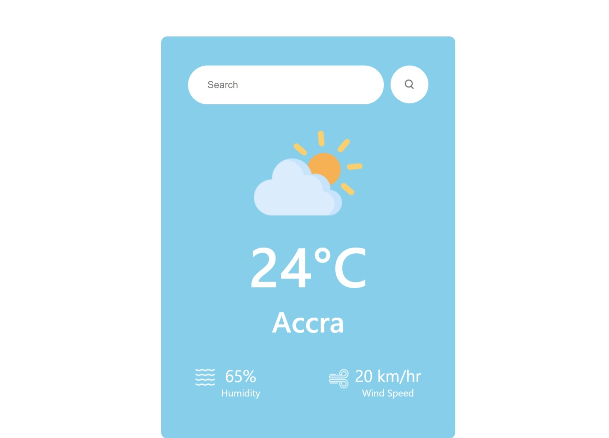

# React Weather App



[Click to view deployed site](https://stupendous-salmiakki-012aeb.netlify.app//) 


## Overview

This is a simple React Weather App that allows users to check the current weather conditions for a specific location. The app displays key weather information such as temperature, weather description, humidity, and wind speed.

## Features

- **Current Weather:** View the current weather conditions for a specific location.
- **Responsive Design:** Accessible and responsive design for various screen sizes.

## Getting Started

Follow these instructions to get a copy of the project up and running on your local machine for development and testing purposes.

### Prerequisites

- [Node.js](https://nodejs.org/) installed on your machine
- Package manager: [npm](https://www.npmjs.com/) or [Yarn](https://yarnpkg.com/)

### Installation

1. Clone the repository:

   ```bash
   git clone https://github.com/abdulsamedtma/react-weather-app.git


## Navigate to the project directory:

```bash
cd react-weather-app
```

## Install dependencies:
``` bash
npm install
or
yarn install

```

## Usage
Start the development server:

``` bash
npm start
or
yarn start
Open your browser and navigate to http://localhost:3000 to view the app.
```

## Built With
React - JavaScript library for building user interfaces.
OpenWeatherMap API - API for retrieving weather data.
Contributing
Contributions are welcome! If you have any suggestions or improvements, please open an issue or create a pull request.

## License
This project is licensed under the MIT License - see the LICENSE file for details.

## Acknowledgments
Inspired by my passion for impacting the  humanity using technology

## Contact
GitHub: https://github.com/abdulsamedtma

Email: abdulsamedtma@gmail.com